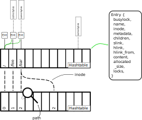

---
geometry:
- top=3cm
- bottom=3cm
- left=2.5cm
- right=2.5cm
---

1. Filesystem Design
====================

This section describes the basic design which we are aiming to implement. We start by listing characteristics which our filesystem should fulfill, later on come to describe how we are aiming to achieve these and lastly give an overview of the complete architecture of the filesystem.

1.1 Desired features 
--------------------

We aim to deliver a constant access time to files and directories, especially the access to already existing files should be done quickly and not rely on adjacent path characteristics such as the depth of the path.
Additionally we want to minimize the performance impact of deletion, and moving of files in the filesystem.
Due to the implementation as a memory-only fs writing and reading should be done as efficiently as possible too.

1.2 Implementation
------------------

Here we discuss some details and potential stepping stones regarding the implementation. A rough overview can be had in Figure 1. Which shows the central hashtable and some basics characteristics.

1.2.1 Entry and Tree Structures
-------------------------------

To provide a fast access to files and identify resources based on their path to the according internally used inode, we are aiming to use [swisstables](https://abseil.io/blog/20180927-swisstables) with a [wrapper library](https://github.com/taviso/swisstable) to use them within C. Swisstables are a high performant hash-table implementation which are often used for performance critical hash-tables and potential bottlenecks, originally implemented in C++ adoptions of them are found in the [Rust standard library](https://doc.rust-lang.org/stable/std/collections/hash_map/struct.HashMap.html) or [Haskell](https://hackage.haskell.org/package/swisstable).
This decision allows for a direct access of paths (if the paths are used as key) and allows in reasonable certainty a fast access and insertion for each node of the filesystem.

To guarantee the consistency and correctness of the actual tree we are trying to model with this approach, we rely on the implementation to check certain aspects such as directory relations (A parent directory must exist before a child in the path is created, deleted files/directories, renaming of files and their successive move in the table).

In this hashtable all relevant information of the entries are held. Starting with the name of the entry, the metadata, potential children, link endpoint, and existing locks on this file.
Whereas the children and locks are stored as list for example with GList or similar used. An overview of the structure how this hashmap is used and how the relations are interacting are displayed in Figure 1. These lists can be dynamically extended and do not require much additional effort in ensuring safe access.

Children of nodes are not stored as their key, but as a direct pointer to their according buffer. This has been done to avoid searching multiple times for characteristics such as the name, size... in the hashtable in readdir and similar operations.
We treat this decision as safe, as we plan to keep deleted files alive in our memory, and indicate their unlinked status with a set to `st_link` to 0 in the metadata.
This keeps invalid references memory-wise sane, though semantic errors might well exist if a file is moved to a different subtree of the filesystem.
We think this decision is worthwhile, as the situations where these semantic errors might occur are relatively seldom in occurence compared to the overhead of multiple lookups, and they can be easily treated by cheaply modifying the parent child list. (The targeted implementation here is a double linked list due to it's cheap modification).

In the end the freeing of all entries and keys can be easily done with provided functions for a traversal over all known keys.

1.2.2 Locking
-------------

Locks used in our implementation represent at how they are defined in `man 2 fcntl` as they are also used by `fuse` in this manner. 
Once a file is locked and we receive the according `flock` struct, we add this to our knowledge of the file in our filesystem entry.

Later on as we know all existing locks, we can check before write and read operations are performed which locks are currently active for which `pid` and react accordingly. Multiple locks on different areas of the given file are also possible with this structure as we can hold multiple locks at the same time, which are associated to the same file.

1.2.3 Links
-----------

To handle links efficiently we added two additional fields in our Entry structure each containing a pointer.

The field `slink` will only ever be filled if this entry represents a soft or symbolic link. It contains the key of the other entry, namely its path to allow it being changed dynamically and be potentially dangling.

In comparison, the field `hlink` represents a hard link to another filesystem entry, this field will simply hold the reference to this other entry. This adds a small overhead to the file, but should not have a significant impact on the overall performance as a simple pointer with no higher logic is used.
In case of deletion request of the original file entry, we might want to transfer the ownership of the content and metadata to this hard link as to prevent the recreation of a file in position of the deleted file to overwrite still existing hard links to the former file content and permissions.
To realize this we might want to notify the existing hard links and pick a successor to hold the current data. 
For this to work the file needs to know which hard links exist, this is contained in the `hlink_from` list.
From it we can pick for instance the first always as replacement. The copy operations in this scope are not too expensive as they are mostly less then ten pointers and only some primitive values.

1.2.4 Global restrictions
-------------------------

The restrictions taken in the assignment, namely the 4 GiB upper size limit for the whole filesystem and 10 MiB for individual files, are kept in place to some invariants included in the write operations and the global filesystem state. In the global state a counter `total_bytes` exists which tracks the amount of allocated bytes in the complete structure. This includes file descriptors, file content, various managing structures such as lists and so on.
The file barrier is held in place by allowing a maximum of 10 MiB for file allocations at all time.

