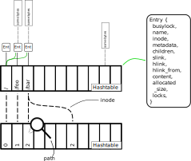

---
geometry:
- top=3cm
- bottom=3cm
- left=2.5cm
- right=2.5cm
---

1. Filesystem Design
====================

This section describes the basic design which we are aiming to implement. We start by listing characteristics which our filesystem should fulfill, later on come to describe how we are aiming to achieve these and lastly give an overview of the complete architecture of the filesystem.

1.1 Desired features 
--------------------

We aim to deliver a constant access time to files and directories, especially the access to already existing files should be done quickly and not rely on adjacent path characteristics such as the depth of the path.
Additionally we want to minimize the performance impact of deletion, and moving of files in the filesystem.
Due to the implementation as a memory-only fs writing and reading should be done as efficiently as possible too.

1.2 Implementation
------------------

Here we discuss some details and potential stepping stones regarding the implementation. A rough overview can be had in Figure 1. Which shows the central hashtable and some basics characteristics.

{ width=80% }

1.2.1 Entry and Tree Structures
-------------------------------

To provide a fast access to files and identify resources based on their path to the according internally used inode, we are aiming to use [swisstables](https://abseil.io/blog/20180927-swisstables) with a [wrapper library](https://github.com/taviso/swisstable) to use them within C. Swisstables are a high performant hash-table implementation which are often used for performance critical hash-tables and potential bottlenecks, originally implemented in C++ adoptions of them are found in the [Rust standard library](https://doc.rust-lang.org/stable/std/collections/hash_map/struct.HashMap.html) or [Haskell](https://hackage.haskell.org/package/swisstable).
This decision allows for a direct access of paths (if the paths are used as key) and allows in reasonable certainty a fast access and insertion for each node of the filesystem.

To guarantee the consistency and correctness of the actual tree we are trying to model with this approach, we rely on the implementation to check certain aspects such as directory relations (A parent directory must exist before a child in the path is created, deleted files/directories, renaming of files and their successive move in the table).

In this hashtable all relevant information of the entries are held. Starting with the name of the entry, the metadata, potential children, link endpoint, and existing locks on this file.
Whereas the children and locks are stored as list for example with GList or similar used. An overview of the structure how this hashmap is used and how the relations are interacting are displayed in Figure 1. These lists can be dynamically extended and do not require much additional effort in ensuring safe access.

Children of nodes are not stored as their key, but as a direct pointer to their according buffer. This has been done to avoid searching multiple times for characteristics such as the name, size... in the hashtable in readdir and similar operations.
We treat this decision as safe, as we plan to keep deleted files alive in our memory, and indicate their unlinked status with a set to `st_link` to 0 in the metadata.
This keeps invalid references memory-wise sane, though semantic errors might well exist if a file is moved to a different subtree of the filesystem.
We think this decision is worthwhile, as the situations where these semantic errors might occur are relatively seldom in occurence compared to the overhead of multiple lookups, and they can be easily treated by cheaply modifying the parent child list. (The targeted implementation here is a double linked list due to it's cheap modification).

In the end the freeing of all entries and keys can be easily done with provided functions for a traversal over all known keys.

---

*Addendum*: A new hash map has been introduced which holds the allocated inodes
of the entry hash map. This allows for an easy creation of soft links and
simpler migration of hard-links. This new hashmap seen in Figure 1 in the lower
half is also swisstable which takes the path to an entry as it's key and returns
a pointer to the underlying inode.

---

Below the structure used and implemented can be seen (starting `memoryfs.c:36`). Not mentioned members have not been completed yet.

```C
struct fs_node {
	// A poor mans spinlock, this is better substituted
    // with another explicit structure but time is running low...
	atomic_flag busy;
	const char* name;
	GList* children;
	size_t num_children;
	char* content;
	size_t allocated_size;
	inode inode;
	struct stat stat;
};
```

1.2.2 Locking
-------------

Locks used in our implementation represent at how they are defined in `man 2 fcntl` as they are also used by `fuse` in this manner. 
Once a file is locked and we receive the according `flock` struct, we add this to our knowledge of the file in our filesystem entry.

Later on as we know all existing locks, we can check before write and read operations are performed which locks are currently active for which `pid` and react accordingly. Multiple locks on different areas of the given file are also possible with this structure as we can hold multiple locks at the same time, which are associated to the same file.

---

*Addendum*: This is not implemented yet, as can be seen by it's absence in the
given implemented `fs_node` struct. Locking has been implemented to allow for
parallel access on the filesystem on shared directories or files via cheap
atomic spinlocks (although file locking is quite primitive as of now as files
are completely locked down on operations e.g. write even if the desired ranges
are non-overlapping). These also have to be reworked as the usage of spinlocks
based on `atomic_flag` are suboptimal (see link: [torvalds rage
lol](https://www.realworldtech.com/forum/?threadid=189711&curpostid=189723)).

---

1.2.3 Links
-----------

To handle links efficiently we added two additional fields in our Entry structure each containing a pointer.

The field `slink` will only ever be filled if this entry represents a soft or symbolic link. It contains the key of the other entry, namely its path to allow it being changed dynamically and be potentially dangling.

In comparison, the field `hlink` represents a hard link to another filesystem entry, this field will simply hold the reference to this other entry. This adds a small overhead to the file, but should not have a significant impact on the overall performance as a simple pointer with no higher logic is used.
In case of deletion request of the original file entry, we might want to transfer the ownership of the content and metadata to this hard link as to prevent the recreation of a file in position of the deleted file to overwrite still existing hard links to the former file content and permissions.
To realize this we might want to notify the existing hard links and pick a successor to hold the current data. 
For this to work the file needs to know which hard links exist, this is contained in the `hlink_from` list.
From it we can pick for instance the first always as replacement. The copy operations in this scope are not too expensive as they are mostly less then ten pointers and only some primitive values.

1.2.4 Global restrictions
-------------------------

The restrictions taken in the assignment, namely the 4 GiB upper size limit for the whole filesystem and 10 MiB for individual files, are kept in place to some invariants included in the write operations and the global filesystem state. In the global state a counter `total_bytes` exists which tracks the amount of allocated bytes in the complete structure. This includes file descriptors, file content, various managing structures such as lists and so on.
The file barrier is held in place by allowing a maximum of 10 MiB for file allocations at all time.

---

*Addendum 1*:
We have introduced a small wrapper around `malloc` and `realloc` which tracks most allocations.

*Addendum 2*:
The overall performance can be greatly enhanced further by using the `fuse_file_info` data and storing the filehandle inode within, this would save us about a quarter of lookups in the hashmap and in the worst-case.

---

2. Filesystem Serialization
===========================

In the effort of writing the planned filesystem to a storage device or similar serialized format, we explain in this section how we plan to utilize and organize a fixed amount of space to write the filesystem as to allow future reinitialization and some degree of fail-safety.

2.1 General partition of the available storage
==============================================


The filesystem itself is partitioned into two major realms, first the superblock containing the inodes, paths, file metadata and other information about the filesystem and second the content of these files.
In Figure 2 we show an approximate overview of this partition scheme. Areas colored in green and blue represent the superblock, the rest of the device is colored in orange representing the content of individual files.


2.2 Inodes
==========

As already mentioned the inodes are stored in the superblock at the beginning of the device. We discuss at the moment if it is sensible to store the path on disk with them. An alternative would be to store only the names of the files in the file entries and construct the paths anew by traversing the file tree once as we have to fill the hashtables anyway again. With these inodes a block id is given to the block storing the metadata of the inode.


2.3 Metadata
============

The metadata of the file entries is the next major content stored in the superblock. There a modified version of the `fs_node` struct is stored. 

```C
struct fs_node {
	inode inode;
	struct stat stat;
	size_t name_length;
	char* name;
	size_t children_length;
	inode* children;
	size_t blocks_length;
	block_pointer* blocks;
};
```

Difficult point in the implementation of this will be the variable width elements in this base structure leading to a relatively difficult structure in the superblock or inefficient space usage. For now we will give a large amount (4 KiB) to each entry in the beginning and larger entries will have to occupy more blocks. This can be done via a similar approach as in the content blocks, as in continuing the data will be done via a block pointer in this case stored in the current block, though accessing them will be more effort this way.

Sufficiently large file systems may reach the allocated superblock size with enough entries and large directories, in this case we need to extend the superblock size.
This may be very inefficient and should be avoided at all costs as shifting the content stored after the superblock would be required. Depending on the file system size this has creates greater impact.
Another way to prevent this is to reorder blocks in our block device layout. By assigning content blocks from the front and superblock block range from the back less copying may be needed as only the superblock would need to be shifted if space is available.

2.4 Content
===========

Outside of this superblock the memory will be managed in blocks, whereas our block size is selectable, by default 4 KiB are used. These blocks are then assigned to certain inodes, with one block belonging to one or none inodes. The distribution of these blocks will be done with an allocation manager distributing known free blocks to inodes requesting more space, the information to which blocks are assigned to files are then stored in the file entries. This is done via a block pointers indexing a beginning block and a range of following blocks.

---

```C
struct block_pointer {
	size_t b_begin;
	size_t b_count;
}
```

\rightline{\emph{The block number is counted in total, the superblock is treated as a large zone of allocated blocks.}}

---


The file entries are then able to fetch their content via a wrapper which receives the file entry information, a destination buffer, and desired range in the file and stitches these blocks together.

This block distributor will perform a rather simple greedy distribution which might lead to more fragmentation, though this approach can be changed later on modularly without effect to other logic. Aspects taken into consideration are the continuation of memory, e.g. if in Figure 3 the example file requires a greater amount of space the block distributor will choose to extend the block range starting at `block_id` 5 instead of the free range at `block_id` 4.

Internally the block distributor will store the beginning and length of free block ranges, these will also be stored in the superblock to avoid a recreation in case of a filesystem restart.

Choosing this structure has the consequence of centralizing this block distribution as not more than one actor may modify this state, resulting in a reduction of performance when multiple files are extended beyond their allocated range. Though any other operations may be performed unbounded from another.
 
2.5 Data Integrity and Fail Safety
==================================

In case of crashes we try to read out structures as good as possible, tough in some case such as extra blocks for metadata in the superblock we might lose some data if the next block for the current file entry has not been written at the instant of the crash.
Similarly content blocks may be missing if the file entry has not written out the extra blocks to disk.
We aim to keep the possible occurrences of corruption of files to a minimum but since these are separate write calls we may not guarantee this.
